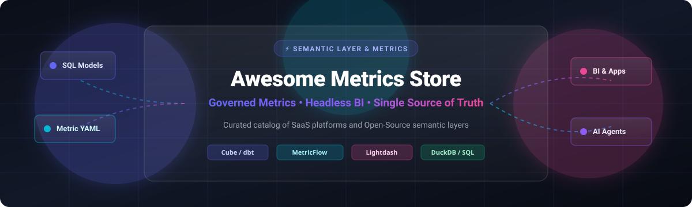

<div align="center">

# 📊 Awesome Metrics Store & Semantic Layer Platforms

<a href="https://github.com/ishandutta2007/Awesome-Awesome-Awesome"></a>
<a href="https://discord.gg/jc4xtF58Ve"></a>
<a href="https://github.com/ishandutta2007/Awesome-Metrics-Store-Platform/stargazers"></a>
<a href="https://github.com/ishandutta2007/Awesome-Metrics-Store-Platform/network/members"></a>
<a href="https://github.com/ishandutta2007/Awesome-Metrics-Store-Platform/blob/main/LICENSE"></a>
<a href="https://github.com/ishandutta2007"></a>

<br/><br/>



<p align="center">
  <b>A Curated List of Awesome Metrics Store Platforms, Semantic Layers, Headless BI, Governed Metric Repositories &amp; Metric APIs.</b>
</p>

</div>

---

## 🌟 Overview & Ecosystem Architecture

Welcome to **Awesome Metrics Store & Semantic Layer Platforms**! 🚀 

In the modern data stack, a **Metrics Store** (or **Semantic Layer**) sits between analytical data storage (like Snowflake, BigQuery, Databricks, ClickHouse, DuckDB) and downstream consumption interfaces (BI dashboards, notebooks, web applications, and autonomous AI agents). 

### 🎯 Key Benefits
- 🔒 **Single Source of Truth**: Define metrics (e.g., `churn_rate`, `net_revenue`) once in code (YAML/SQL) to eliminate logic divergence.
- ⚡ **High-Performance Caching & Pre-aggregation**: Accelerate complex dimensional queries and rollups with sub-second latency.
- 🔌 **Universal Metric APIs**: Query metrics seamlessly via SQL, REST, GraphQL, and MCP (Model Context Protocol).
- 🤖 **AI-Ready Context**: Feed structured, business-governed semantics directly into LLMs and autonomous data agents.

---

## 📑 Table of Contents
- [🏢 SaaS & Hosted Platforms](#-saashosted-platforms)
- [💻 Open-Source GitHub Projects](#-open-source-github-projects)
- [🛠️ Architecture & Custom Implementation Patterns](#️-architecture--custom-implementation-patterns)
- [📈 Star History](#-star-history)
- [🤝 How to Contribute](#-how-to-contribute)
- [📜 Disclaimer](#-disclaimer)

---

## 🏢 SaaS/Hosted Platforms

The following SaaS platforms provide hosted metrics stores, enterprise semantic layers, and governed BI platforms. Entries are sorted descending by company scale (market valuation / revenue).

| Product | Valuation / Scale (USD) | Description | Pricing | Free Tier Limits |
| :--- | :--- | :--- | :--- | :--- |
| **[Looker (Google Cloud)](https://cloud.google.com/looker)** | **~$4.2T** *(Alphabet Parent)* | Enterprise BI platform featuring LookML as its centralized semantic modeling language and governed metrics store. | Custom enterprise annual contracts starting at ~$3,000–$5,000/month (~$36,000–$60,000/year for Standard Edition) | 30-day free proof-of-concept / evaluation trial via Google Cloud sales |
| **[dbt Semantic Layer](https://www.getdbt.com/)** | **~$4.2B+** *($100M+ ARR / Fivetran entity)* | Cloud-hosted semantic layer powered by MetricFlow to define governed metrics in dbt and query across BI tools. | Starts at $100/developer seat/month (Starter tier; full semantic integrations on Enterprise tier) | 14-day free trial of Team/Enterprise features; Free Developer tier includes 1 seat & 3,000 models/mo (Semantic Layer requires paid tier) |
| **[Transform](https://transform.co/)** | **~$4.2B+** *(Acquired by dbt Labs)* | Original pioneer metrics store platform; acquired by dbt Labs and integrated into dbt Semantic Layer / MetricFlow. | Standalone product retired; accessible via dbt Cloud starting at $100/developer seat/month | N/A (Integrated into dbt Cloud; offers 14-day dbt Cloud trial or dbt Cloud Developer free tier with 1 seat & 3,000 models/mo) |
| **[MetricFlow (via dbt Cloud)](https://docs.getdbt.com/)** | **~$4.2B+** *(Part of dbt Labs ecosystem)* | Governed metric definition framework and SQL compilation engine powering the dbt Semantic Layer. | Included with dbt Cloud Starter at $100/developer seat/month (Enterprise custom for advanced features) | Core engine is 100% free open-source (Apache 2.0); Cloud Semantic Layer includes 14-day free trial on dbt Cloud |
| **[Omni](https://omni.co/)** | **~$1.5B** *(Series C, ~$30M ARR)* | Modern analytics and BI platform with a built-in semantic modeling layer and point-and-click data exploration. | Sales-led starting from ~$1,000/month for small team deployments (custom quote based on user seats and scope) | 14-day customized free evaluation trial (available upon sales request/demo) |
| **[AtScale](https://www.atscale.com/)** | **~$500M–$750M** *($150M+ funding)* | Universal semantic layer and virtual OLAP platform optimizing governed metrics across data warehouses and BI tools. | Object-based consumption model starting at ~$2,500/month based on Deployed Semantic Objects (DSOs) | Free Developer Community Edition for building/testing semantic models; 30-day guided enterprise free trial upon request |
| **[Hex](https://hex.tech/)** | **~$400M** *(Series C, ~$20M ARR)* | Collaborative workspace combining notebooks, SQL, metrics layer integrations, and interactive app builder. | Professional plan starts at $36/editor/month (Team plan at $75/editor/month; free viewer seats) | Free forever Community plan: 1 editor, up to 5 projects, small compute profiles (4GB RAM, 0.5 CPU), 100 AI actions/month |
| **[GoodData](https://www.gooddata.com/)** | **~$150M+** *($168M funding / Rule of 40)* | Composable data analytics and semantic layer platform tailored for governed metrics and multi-tenant embedded analytics. | Platform fee starting at ~$1,500/month based on workspaces and data scale (custom quote) | 30-day full-featured free trial (no credit card required) |
| **[Lightdash Cloud](https://www.lightdash.com/)** | **~$50M–$100M** *(Series A, $11M+ funding)* | Managed BI and metrics exploration platform native to dbt projects with AI data analyst capabilities. | Cloud Starter starts at $800/month (unlimited users); Cloud Pro starts at $2,400/month | 21-day free trial (no credit card required; core platform is free self-hosted open-source) |
| **[Cube Cloud](https://cube.dev/)** | **~$24M–$50M** *(~$8M ARR)* | Managed service for the Cube semantic layer, providing caching, pre-aggregations, APIs (SQL/REST/GraphQL), and embedded analytics. | Consumption-based starting at ~$0.10 / Cube Consumption Unit (CCU) (no fixed monthly minimum) | Free forever plan: Up to 2 shared deployments for dev/testing (no credit card required) |

---

## 💻 Open-Source GitHub Projects

The following open-source frameworks provide self-hosted semantic layers, metrics modeling engines, headless BI tools, and data transformation frameworks. Entries are sorted descending by GitHub Star count.

- **[Apache Superset](https://github.com/apache/superset)** [](https://github.com/apache/superset/stargazers)  
  ⚡ Enterprise-grade, open-source data exploration and business intelligence visualization platform that pairs seamlessly with semantic layers like Cube and MetricFlow.

- **[Metabase](https://github.com/metabase/metabase)** [](https://github.com/metabase/metabase/stargazers)  
  📊 The easy, open-source BI and dashboarding tool that lets everyone in your company ask questions and learn from data, connecting upstream to centralized metrics stores.

- **[DuckDB](https://github.com/duckdb/duckdb)** [](https://github.com/duckdb/duckdb/stargazers)  
  🦆 Fast in-process analytical SQL database engine powering modern local semantic layers, embeddable metric engines, and serverless analytical caching.

- **[Cube (Cube Core)](https://github.com/cube-js/cube)** [](https://github.com/cube-js/cube/stargazers)  
  🧊 Leading open-source semantic layer and universal data model with built-in multi-protocol caching, pre-aggregations, access control, and SQL/REST/GraphQL APIs.

- **[dbt Core](https://github.com/dbt-labs/dbt-core)** [](https://github.com/dbt-labs/dbt-core/stargazers)  
  🛠️ The industry-standard transformation framework that lets data engineers build, test, and document modular metrics-as-code models using SQL and Jinja.

- **[Evidence](https://github.com/evidence-dev/evidence)** [](https://github.com/evidence-dev/evidence/stargazers)  
  📈 Code-driven, markdown-based reporting and business intelligence framework that builds fast, interactive data products directly from governed metrics SQL.

- **[Lightdash](https://github.com/lightdash/lightdash)** [](https://github.com/lightdash/lightdash/stargazers)  
  🔮 Open-source, agentic BI platform natively integrated with dbt projects that automatically converts dbt models and semantic metrics into interactive charts and AI workflows.

- **[SQLMesh](https://github.com/TobikoData/sqlmesh)** [](https://github.com/TobikoData/sqlmesh/stargazers)  
  🔄 Next-generation data transformation and semantic modeling framework featuring virtual environments, automated lineage, and unit testing for reliable metrics pipelines.

- **[Rill Developer](https://github.com/rilldata/rill)** [](https://github.com/rilldata/rill/stargazers)  
  ⚡ Fast, operational BI tool and embedded metrics exploration engine powered by DuckDB, designed for sub-second multidimensional metric slice-and-dice.

- **[Malloy](https://github.com/malloydata/malloy)** [](https://github.com/malloydata/malloy/stargazers)  
  🧪 Experimental yet powerful open-source data modeling language that compiles rich semantic models and complex nested metrics into efficient SQL.

- **[MetricFlow](https://github.com/dbt-labs/metricflow)** [](https://github.com/dbt-labs/metricflow/stargazers)  
  ⚙️ Open-source SQL generation and metric definition engine (Apache 2.0) that acts as the core engine underneath the dbt Semantic Layer.

---

## 🛠️ Architecture & Custom Implementation Patterns

```
                 ┌────────────────────────────────────────────────────────┐
                 │                  Downstream Consumers                  │
                 │   (BI Dashboards, Hex Notebooks, AI Agents, REST/Apps) │
                 └───────────────────────────▲────────────────────────────┘
                                             │  (SQL / GraphQL / REST / MCP)
                 ┌───────────────────────────┴────────────────────────────┐
                 │           Universal Semantic / Metrics Layer            │
                 │   • Single Source of Truth for Metric Logic (YAML/SQL) │
                 │   • Pre-Aggregation & Caching Engine (Cube / DuckDB)   │
                 │   • Role-based Access Control (RBAC) & Governance       │
                 └───────────────────────────▲────────────────────────────┘
                                             │
                 ┌───────────────────────────┴────────────────────────────┐
                 │           Cloud Data Warehouse & Analytical Engines     │
                 │  (Snowflake, BigQuery, Databricks, ClickHouse, DuckDB) │
                 └────────────────────────────────────────────────────────┘
```

### 💡 Modern Metrics-as-Code Workflow
1. **Define in Git**: Express dimension definitions and metric aggregations in version-controlled YAML files (using MetricFlow or Cube models).
2. **Test in CI**: Run automated semantic validation and unit tests (with SQLMesh or dbt) before merging pull requests.
3. **Serve Everywhere**: Expose metrics through universal endpoints so BI tools, custom frontend dashboards, and LLM coding assistants calculate numbers identically.

---

## 📈 Star History

[](https://star-history.dera.page/#ishandutta2007/Awesome-Metrics-Store-Platform&type=date&legend=top-left)

---

## 🤝 How to Contribute

Contributions are always welcome! 💖

1. 🍴 Fork the repository.
2. 📝 Add your recommended platform or open-source tool (make sure to include links, descriptions, pricing/limits if SaaS, or star badges if open-source).
3. 🔀 Ensure your additions are placed in the properly sorted position (descending valuation for SaaS, descending stars for Open-Source).
4. 🚀 Submit a pull request with a descriptive title!

---

## 📜 Disclaimer

- This list is a **community-curated index** for informational and educational purposes.
- Valuations, pricing tiers, and star counts are subject to market changes over time.
- Always validate business metrics definitions and governance controls within your organization before standardizing on any single platform.

---

<div align="center">
  <sub>Maintained with ❤️ for analytics engineers, platform architects, and data teams.</sub>
</div>
